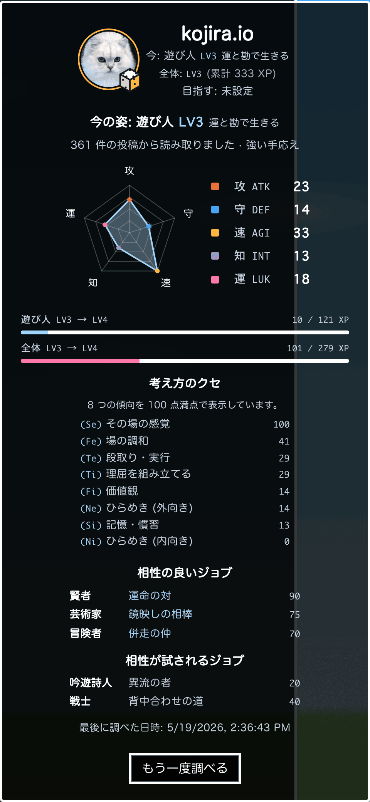
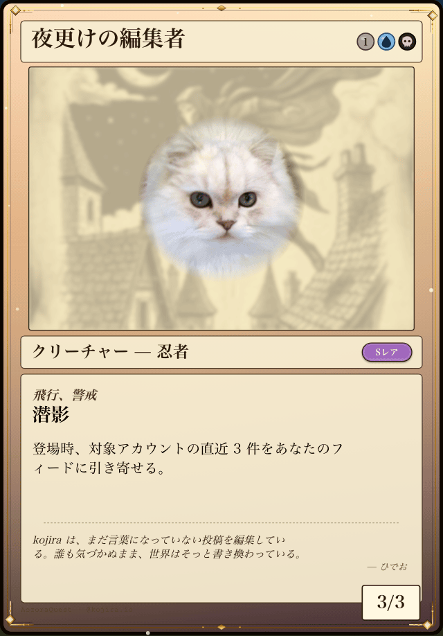

# Aozora Quest

> **Bluesky で投稿しながら、なりたい自分に近づく。**

日々の Bluesky 投稿を AI が読み取って、今のあなたの気質をジョブとステータスで可視化する Web クライアント。**目指す姿を選び、毎日のクエストをこなしていくと、少しずつそこに近づける**。AI 推論はすべて端末内で動くので、投稿内容が外部に送られない。

ライブ版: **https://aozoraquest.app**

推奨ブラウザは最新の Chrome (Gemini Nano 対応)。それ以外のブラウザでは生成系機能 (カード生成・翻訳・スピリット会話) が自動 OFF になり、診断・タイムライン・カード表示などは引き続き使える。

## 何ができるの

### 気質診断 + 「なりたい自分」へのクエスト
過去投稿から今の気質をジョブとステータスで割り出し、「目指す姿」を選ぶと、現状と目標の差を埋める日々のクエストが出る。クエストをこなして投稿すると、その方向のステータスが伸びる。投稿という日常の延長で、自分が変わっていく感覚を可視化する。

  

### MTG 風カードシェア (おまけ)
自分のジョブをモチーフにした、MTG 風のオリジナル TCG カードを LLM が毎回違う内容で生成する。引いたカードはそのまま Bluesky に画像投稿できる。

  

### タイムライン自動翻訳
英語などの非日本語投稿を自動検出して、その場で日本語化。LLM がブラウザ内で動くので、投稿内容がクラウドに送られない。

### 精霊ブルスコンとおしゃべり
ローカル LLM で動く精霊キャラクターと自由に会話できる。

### フォロー相性ランキング
フォロー相手との気質の相性が見える。相手が aozoraquest を使っていなくても、公開投稿から相性を計算する。

### Bluesky クライアントとしても完成度高め
タイムライン、投稿・引用リポスト・リプライ、スレッドのインライン展開、通知、検索 (ハッシュタグ含む)、プロフィール表示、画像 lightbox など。診断・カード・スピリット機能を切っても普通の Bluesky クライアントとして使える。

## 何が違うの

- **AI 推論は端末内のみ** — Chrome の Gemini Nano と ONNX/WASM の埋め込みモデルで動く。クラウド LLM API には投稿内容を送らない
- **データはあなたの PDS に保存される** — アプリは読み書きするレンズで、独自 DB を持たない
- **広告・有料プラン・トラッキングなし** — 商用化しない

---

## 開発者向け

### 設計文書

実装に必要な情報はすべて `docs/` 以下にある。

| ファイル | 内容 |
|---|---|
| [docs/01-overview.md](docs/01-overview.md) | プロジェクト全体像、コンセプト、設計原則 |
| [docs/02-architecture.md](docs/02-architecture.md) | システムアーキテクチャ、レイヤー、データフロー |
| [docs/03-game-design.md](docs/03-game-design.md) | 5 ステータス、16 ジョブ、クエスト、成長ループ |
| [docs/04-diagnosis.md](docs/04-diagnosis.md) | 気質診断のアルゴリズムと認知機能 |
| [docs/05-compatibility.md](docs/05-compatibility.md) | 他ユーザーとの共鳴 (相性) システム |
| [docs/06-spirit.md](docs/06-spirit.md) | 精霊キャラクターの人格とセリフ設計 |
| [docs/07-ui-design.md](docs/07-ui-design.md) | 画面レイアウトとインタラクション |
| [docs/08-data-schema.md](docs/08-data-schema.md) | PDS カスタムレキシコンの定義 |
| [docs/09-tech-stack.md](docs/09-tech-stack.md) | 技術選定と実装ガイドライン |
| [docs/10-roadmap.md](docs/10-roadmap.md) | MVP スコープと開発順序 |
| [docs/11-validation.md](docs/11-validation.md) | パラメータ検証プロトコル (Browser LLM 選定ほか) |
| [docs/12-testing.md](docs/12-testing.md) | テスト戦略 (Unit / Integration / E2E) |
| [docs/13-ops.md](docs/13-ops.md) | 運用 (CI/CD、モニタリング、セキュリティ、法務) |
| [docs/14-admin.md](docs/14-admin.md) | 管理者ダッシュボード設計 |

### データ定義

| ファイル | 内容 |
|---|---|
| [docs/data/jobs.json](docs/data/jobs.json) | 16 ジョブの配分と表示名 |
| [docs/data/action-weights.json](docs/data/action-weights.json) | 行動 × ステータス重み表 |
| [docs/data/tags.json](docs/data/tags.json) | タグ分類のプロトタイプ例 |

### 検証スクリプト

| スクリプト | 用途 |
|---|---|
| [scripts/validate-llm.ts](scripts/validate-llm.ts) | 埋め込みモデル 5 種の日本語分類精度ベンチ (Ruri-v3 採用確定、実験 1) |
| [scripts/validate-llm-gen-playwright.ts](scripts/validate-llm-gen-playwright.ts) | Playwright + Chromium WebGPU で生成 LLM を実機ベンチ |
| [scripts/validate-llm-cls-playwright.ts](scripts/validate-llm-cls-playwright.ts) | ゼロショット LLM 分類ベンチ (TinySwallow vs MiniLM 比較用) |
| [scripts/validate-llm-gemini.ts](scripts/validate-llm-gemini.ts) | Gemini クラウド API による分類ベースライン |
| [scripts/validate-llm-minilm-sweep.ts](scripts/validate-llm-minilm-sweep.ts) | 任意埋め込みモデルの閾値スイープ |
| [scripts/validate-llm-gen-harness.html](scripts/validate-llm-gen-harness.html) | 生成実測ハーネス (Playwright から駆動) |
| [scripts/validate-llm-cls-harness.html](scripts/validate-llm-cls-harness.html) | 分類実測ハーネス |
| [scripts/validate-llm-gen-browser.html](scripts/validate-llm-gen-browser.html) | 手動ブラウザ実測 UI (モバイル検証用) |
| [scripts/validate-llm-browser.html](scripts/validate-llm-browser.html) | 埋め込みの手動ブラウザ実測 |

詳細は [scripts/README.md](scripts/README.md)。ベンチマーク結果は [docs/data/llm-benchmark.md](docs/data/llm-benchmark.md) 他。

### 実装者へのメモ

この文書は「何を作るか」を定義する。「どう書くか」は実装者に委ねる。ただし以下の原則は守ること。

1. **サーバー層を作らない**。運用コンフィグは主管理者 DID の PDS に保存 (14-admin.md)、Cloudflare Workers Builds による静的配信のみ
2. **ユーザーデータはすべて PDS に保存**。アプリは読み書きするレンズであってデータベースではない
3. **LLM 呼び出しはローカル優先**。認知機能分類は Ruri-v3 ベース 30m ONNX (WASM 固定)、生成は Chrome の Gemini Nano。Gemini Nano が使えないブラウザでは生成系の機能 (カード文言・スピリット会話・翻訳) を OFF にして案内する
4. **ジョブ名は独自の RPG 名のみで表現する**。既存の商標性のある 4 文字体系に依拠する表記を UI / ソースに含めない
5. **プライバシー**: 投稿の内容が第三者サーバーを経由する処理を避ける
6. **商用化しない**。有料プランなし

### 関連資料

- AT Protocol: https://atproto.com
- Transformers.js: https://huggingface.co/docs/transformers.js
- Cloudflare Workers: https://developers.cloudflare.com
